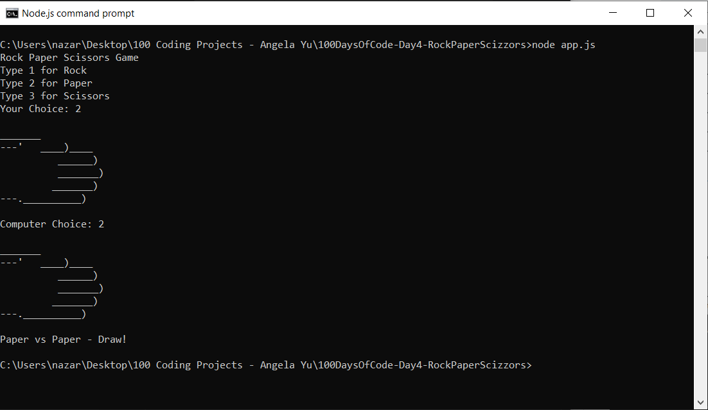

# 100 Days of Code - Day 4 - Rock, Paper, Scissors

# Prompt

Write a program that has the following console features:

* Write "Rock Paper Scissors Game"
* Ask the user to enter a number
* 1 for Rock
* 2 for Paper
* 3 for Scissors
* Create text art to show the users choice
* Using randomization, have the computer pick a choice too.
* if user picks rock, and computer picks paper: computer wins
* if user picks rock, and computer picks rock: its a draw
* if user picks rock, and computer picks scizzors: user wins
* observe the rules of Rock, Paper, Scissors for all outcomes

# Example

Rock Paper Scissors Game

Type 1 for Rock
Type 2 for Paper
Type 3 for Scissors
Your Choice: 1

    _______
---'   ____)
      (_____)
      (_____)
      (____)
---.__(___)

Computer Choice: 2

    _______
---'   ____)____
          ______)
          _______)
         _______)
---.__________)

Computer Wins!

# Screenshot of Working Solution

